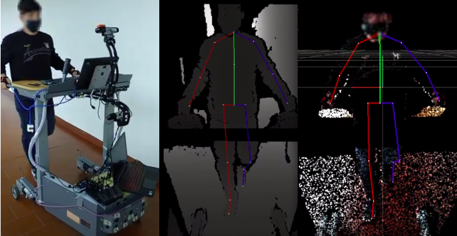

# SmartWalkerDatabase
Scripts to process the [Smart Walker Database](https://physionet.org/content/multi-gait-posture/1.0.0/), for posture and gait analysis.


## Install requirements
```bash
pip install -r requirements.txt 
```


## Run Scripts available
* preprocess_data.py                (loads raw data from database directory and process it)
* read_processed_data.py            (reads and visualizes processed data dir created by `preprocess_data.py` script)
* utils.py                          (utility scripts)


## Processed data sample



Smart  Walker  with  the  mobile  recording  setup; Depth image overlaid with projected 2D skeleton; Point-cloud overlaid with aligned 3D skeleton.
